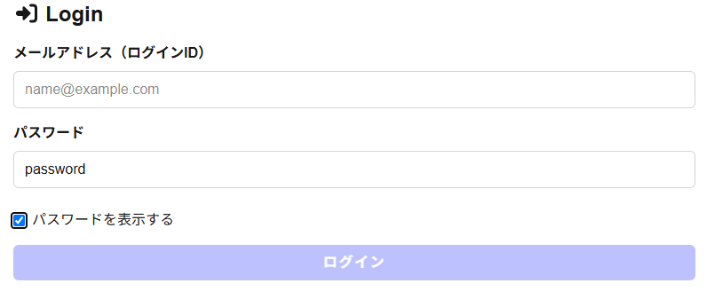
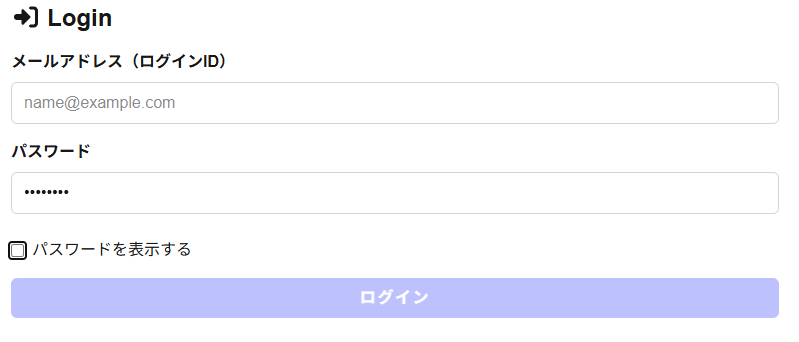
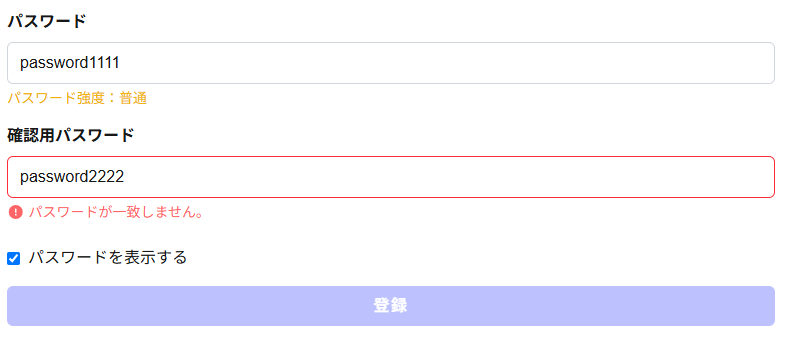
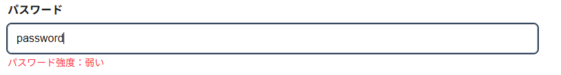
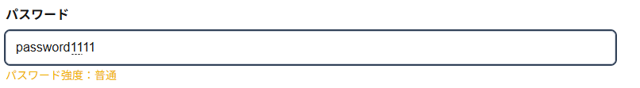
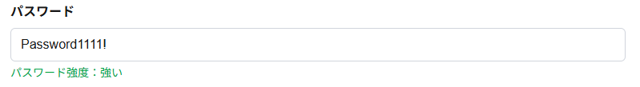
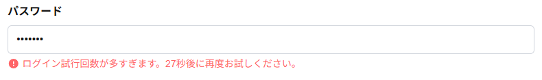

# Web Security 

## 概要

本アプリケーションは、Next.js を用いてセッションベース認証を実装した認証・認可アプリケーションです。
複数の認証・認可機能やセキュリティ対策をしています。

---

## 使用技術

- Next.js
- TypeScript
- React
- Prisma
- SQLite
- Tailwind CSS
- React Hook Form
- Zod
- bcrypt

---

## 認証方式

本アプリでは **セッションベース認証** を採用しました。

ログイン成功後にセッションIDをCookieへ保存し、認証状態を管理しています。

---

## 実装した機能

### 基本機能

- サインアップ
- ログイン
- ログアウト

### 認証・認可機能

- セッションベース認証
- bcryptによるパスワードハッシュ化
- Cookieによるセッション管理

### 追加実装した機能

#### ① パスワード表示・非表示切り替え

ログイン画面・サインアップ画面の両方で表示切り替え。

 

 

---

#### ② パスワード確認入力

サインアップ時に確認用パスワードを入力し、一致しない場合は登録できないようにしている。

 

---

#### ③ パスワード強度表示

入力したパスワードの強度をリアルタイムに表示する機能。
パスワード入力時にリアルタイムで強度を判定する機能を実装した。判定は「文字数」「英大文字」「英小文字」「数字」「記号」の5項目を評価し、その合計点に応じて「弱い」「普通」「強い」を表示する。

 

 

 

---

#### ④ ログイン試行の間隔制限（レートリミット）

ログインに5回失敗すると30秒間ログインを制限する機能。

ブルートフォース攻撃への対策。

 

---

## セキュリティ対策

### パスワード

- bcryptによるハッシュ化

### Cookie

- HttpOnly
- SameSite=Strict
- Secure（本番環境のみ）

### HTTPレスポンスヘッダー

- Content-Security-Policy
- X-Frame-Options
- X-Content-Type-Options
- Referrer-Policy

---

## 工夫した点

- 認証方式をセッション認証へ一本化した
- bcryptを利用してパスワードを安全に保存した
- Cookie属性を適切に設定した
- CSPなど複数のセキュリティヘッダーを追加した
- UI面ではパスワード入力を使いやすく改善した

---

## 今後改善したい点

- CAPTCHAの導入
- メール認証
- パスワードリセット機能
- Remember Me機能
- 現在ログイン中のセッション一覧表示